# Infraestrutura AWS com Terraform

Este repositório documenta a execução do tutorial **Create infrastructure** da HashiCorp, usando Terraform para criar uma infraestrutura simples na AWS como IaC, ou seja, Infraestrutura como Código.

A ideia principal foi escrever a infraestrutura em arquivos `.tf`, inicializar o Terraform, validar a configuração e depois provisionar o recurso na AWS de forma controlada.

## Tecnologias usadas

- Terraform
- AWS CLI
- AWS EC2
- Região `us-west-2`

## Arquivos do projeto

- `terraform.tf`: define a versão mínima do Terraform e o provider `hashicorp/aws`.
- `main.tf`: configura a região da AWS, busca a AMI Ubuntu mais recente e descreve a instância EC2.
- `.terraform.lock.hcl`: trava a versão exata do provider baixado pelo `terraform init`.

## Passo a passo executado

### 1. Verificação do Terraform

Primeiro confirmei a versão instalada do Terraform. Esse passo é importante porque o tutorial exige Terraform `1.2.0` ou superior.

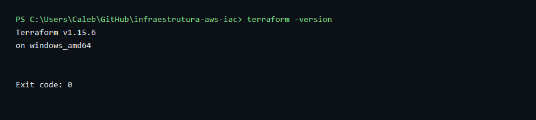

### 2. Verificação da AWS CLI

Depois conferi a configuração da AWS CLI. Ela é usada pelo provider da AWS para autenticar as chamadas feitas pelo Terraform.

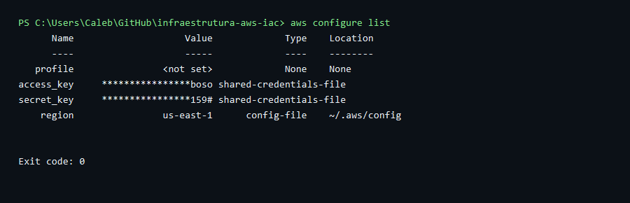

### 3. Formatação dos arquivos Terraform

Executei o `terraform fmt` para manter os arquivos `.tf` no padrão de formatação recomendado pela HashiCorp. Como os arquivos já estavam formatados, o comando não precisou listar nenhum arquivo alterado.

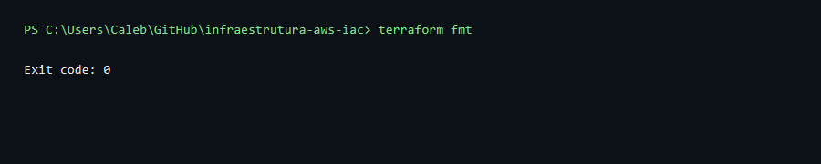

### 4. Inicialização do Terraform

Com os arquivos criados, rodei o `terraform init`. Esse comando inicializa o workspace local e baixa o provider da AWS definido no arquivo `terraform.tf`.

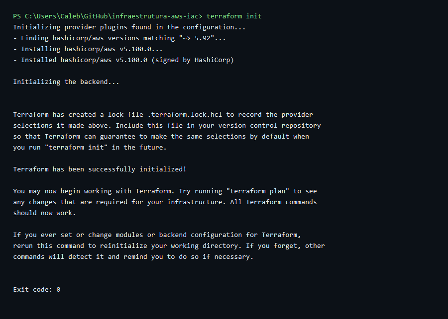

### 5. Validação da configuração

Em seguida rodei o `terraform validate`. Esse comando verifica se a configuração está escrita corretamente e se o Terraform consegue interpretar os blocos definidos.

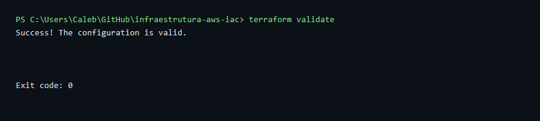

### 6. Autenticação temporária na AWS

Para conseguir executar o provisionamento, usei credenciais temporárias da sessão autenticada no Console AWS. Depois validei a identidade com `aws sts get-caller-identity`.

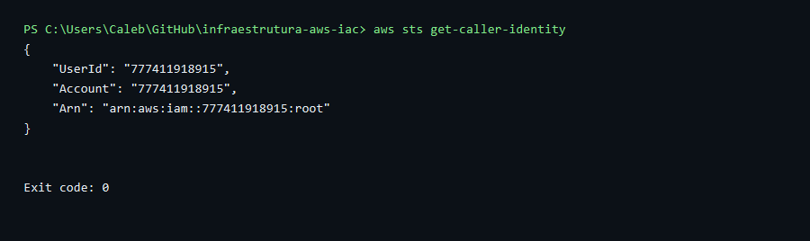

### 7. Aplicação da infraestrutura

Depois rodei o `terraform apply -auto-approve`. Nesse momento o Terraform comparou o código com o estado atual e criou a instância EC2 definida no arquivo `main.tf`.

O tutorial original usa `t2.micro`, mas a AWS bloqueou esse tipo nesta conta por não estar elegível ao Free Tier. Por isso ajustei para `t3.micro`, que apareceu como opção elegível na região `us-west-2`.

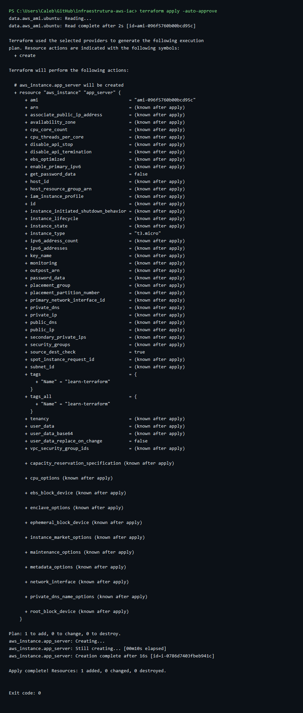

### 8. Conferência do state

Com o recurso criado, rodei `terraform state list` para confirmar quais itens passaram a ser controlados pelo Terraform.

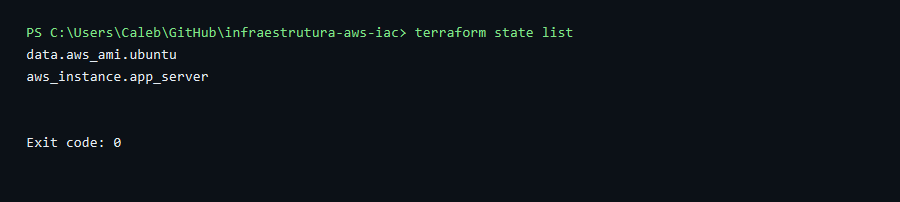

Também usei `terraform show` para ver os detalhes completos do estado local da infraestrutura.

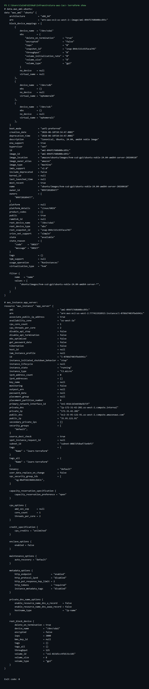

## Itens provisionados na nuvem

O Terraform provisionou uma instância EC2 na AWS com as seguintes características:

- Recurso Terraform: `aws_instance.app_server`
- Nome da instância: `learn-terraform`
- ID da instância: `i-0786d7403fbeb941c`
- Região: `us-west-2`
- Zona de disponibilidade: `us-west-2a`
- AMI: Ubuntu 24.04 Noble (`ami-096f5760b00bcd95c`)
- Tipo de instância: `t3.micro`
- Estado final: `running`

No Console AWS, a instância aparece na lista da região `us-west-2`. O print mostra o nome `learn-terraform`, o ID da instância, o estado `Running`, o tipo `t3.micro`, a zona `us-west-2a` e os status checks aprovados.

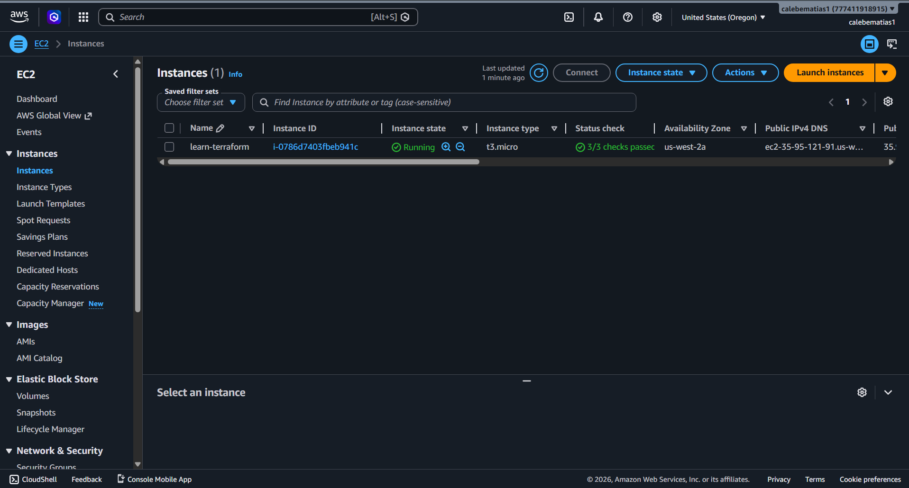

Ao selecionar a instância no Console, também é possível ver o painel de resumo com o ID, IP público, IP privado, DNS público, estado, tipo, VPC, subnet e ARN do recurso criado.

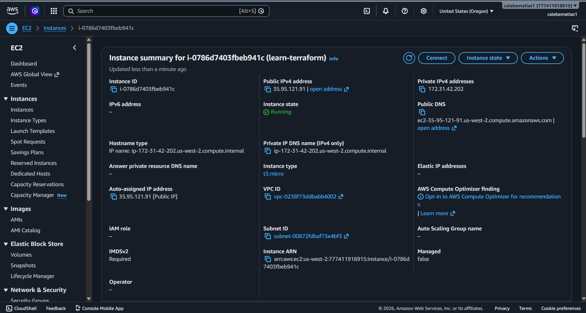

O mesmo recurso também aparece no estado local do Terraform.

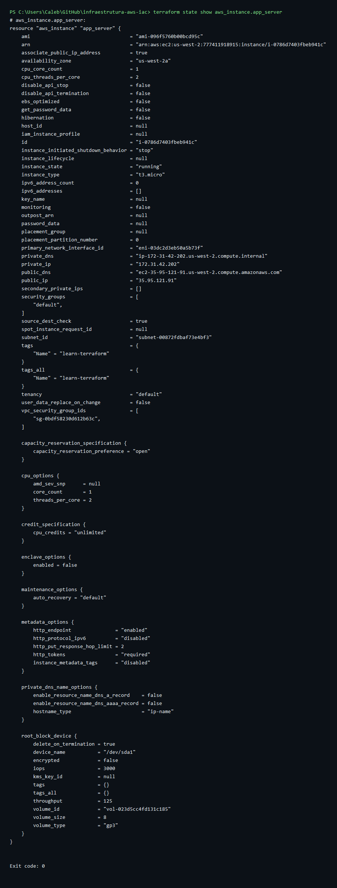

## Observação sobre custos

A instância foi mantida provisionada ao final da atividade, conforme combinado, para permitir conferência posterior no Console AWS.
